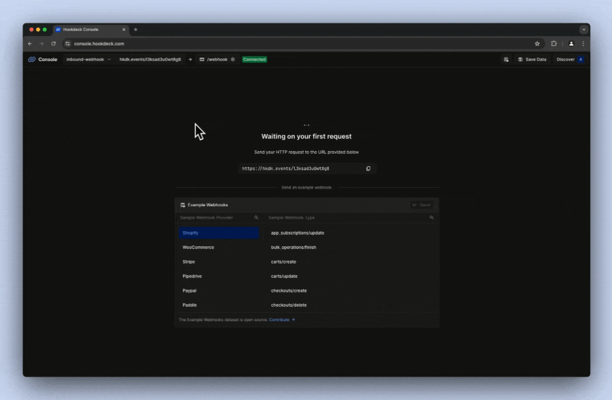
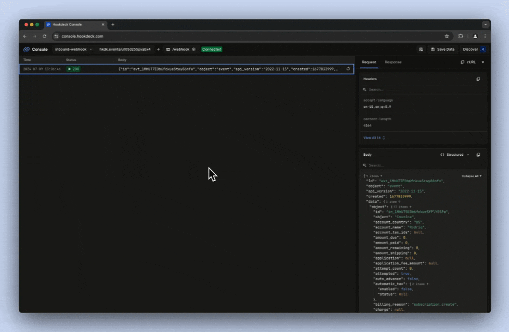
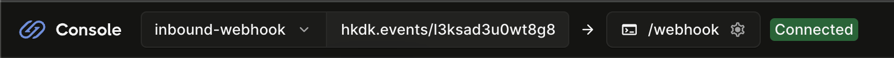
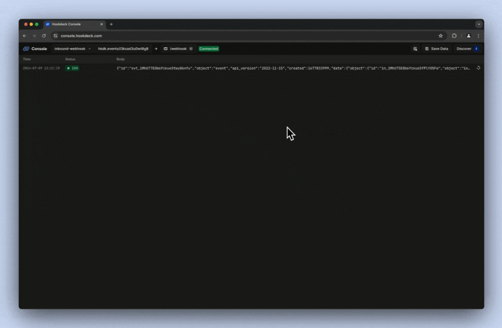

## Introduction

This guide demonstrates how to receive a webhook from services such as Resend, Twilio, Shopify, and Stripe on your localhost development environment using the Hookdeck CLI. You'll learn how to set up your environment, run the Hookdeck CLI, receive webhooks, and replay webhooks from the Hookdeck Console to test your code during development.

## Setup

### Step 1: Install the Hookdeck CLI

Via NPM:

```sh
npm i hookdeck-cli -g
```

On Mac:

```sh
brew install hookdeck/hookdeck/hookdeck
```

On Windows:

```sh
scoop bucket add hookdeck https://github.com/hookdeck/scoop-hookdeck-cli.git
scoop install hookdeck
```

### Step 2: Create and run a localhost web server

Install Flask to use as the web server:

```sh
pip install -U Flask
```

Create a `server.py` file in the project root:

```python
from datetime import datetime
import json
import logging
from flask import Flask, request

# Configure logging to output to the console
logging.basicConfig(
    level=logging.INFO,
    handlers=[logging.StreamHandler()]
)

app = Flask(__name__)
app.logger.setLevel(logging.INFO)

# Define a route to handle POST requests sent to /webhook
@app.route("/webhook", methods=["POST"])
def handle_hello_webhook():
    # Log the received webhook with the current timestamp and JSON payload
    app.logger.info("webhook_received %s %s",
                    datetime.now().isoformat(),
                    json.dumps(request.json, indent=2))

    # Respond with a status of ACCEPTED
    return {
        "status": "ACCEPTED"
    }

if __name__ == "__main__":
    # Run the Flask app on port 3030 in debug mode
    app.run(debug=True, port=3030)
```

Run the server:

```sh
python server.py
```

### Step 3: Create a localtunnel with the Hookdeck CLI

In a new terminal window the following command to create a localtunnel:

```sh
hookdeck listen 3030 my-webhook
```

When prompted with `What path should the events be forwarded to (ie: /webhooks)?`, enter `/webhook` and press **Enter**. This is the base path for all requests sent to the localtunnel.

When prompted with `What's your connection label (ie: My API)?`, enter `My API` and press **Enter**.

The output will look similar to the following:

```sh
Dashboard
👤 Console URL: https://api.hookdeck.com/signin/guest?token={token}
Sign up in the Console to make your webhook URL permanent.

my-webhook Source
🔌 Event URL: https://hkdk.events/{id}

Connections
localhost forwarding to /webhook

> Ready! (^C to quit)
```

## Trigger a webhook

### Step 4: Trigger a test webhook with a cURL command

Run the following cURL command to act as an inbound webhook, replacing the URL with the **Event URL** from the Hookdeck CLI output:

```sh
curl -X POST https://hkdk.events/cnzpo680rdhejk \
  -H "Content-Type: application/json" \
  -d '{"message": "Hello, World!"}'
```

Note that the `/webhook` path is not required in the URL.

The cURL command output will be similar to the following:

```sh
{"status":"SUCCESS","message":"Request handled by Hookdeck. Check your dashboard to inspect the request: https://dashboard.hookdeck.com/requests/req_[id]","request_id":"req_[id]"}%
```

You will see the terminal running the Hookdeck CLI log the inbound webhook:

```sh
2024-07-09 19:06:46 [200] POST http://localhost:3030/webhook | https://console.hookdeck.com/?event_id={id}
```

You will also see the Python server log the inbound webhook:

```sh
INFO:server:webhook_received 2024-07-09T19:06:46.043305 {
  "id": "evt_1MhUT7E0b6fckueStwy86nfu",
  "object": "event",
  "api_version": "2022-11-15",
  "created": 1677833999,
  "data": {
    ...
  },
  "type": "invoice.created"
}
INFO:werkzeug:127.0.0.1 - - [09/Jul/2024 19:06:46] "POST /webhook HTTP/1.1" 200 -
```

### Step 5: Trigger a test webhook from the Hookdeck Console

Open the **Console URL** from your terminal in your browser.

Choose a **Sample Webhook Provider** from the list of **Example Webhooks**. For example, **Stripe**.

Select a **Sample Webhook Type** from the list on the right. For example, **invoice.created**.

Click **Send**.

The Hookdeck Console will show the test webhook has been triggered. You can also inspect the webhook payload and the localhost web server response.



You will see the terminal running the Hookdeck CLI log the inbound webhook:

```sh
2024-07-09 19:06:46 [200] POST http://localhost:3030/webhook | https://console.hookdeck.com/?event_id={id}
```

You will also see the Python server log the inbound webhook:

```sh
INFO:server:webhook_received 2024-07-09T19:06:46.043305 {
  "id": "evt_1MhUT7E0b6fckueStwy86nfu",
  "object": "event",
  "api_version": "2022-11-15",
  "created": 1677833999,
  "data": {
    ...
  },
  "type": "invoice.created"
}
INFO:werkzeug:127.0.0.1 - - [09/Jul/2024 19:06:46] "POST /webhook HTTP/1.1" 200 -
```

### Step 6: Replay the webhook

From the Hookdeck Console, click the **Resend to destination** button to replay the webhook.



### Step 7: Trigger and receive a webhook from an API platform

Copy the **Event URL** from the Hookdeck CLI output. The same URL can also be found in the Hookdeck Console.



Go to the API provider platform, such as Resend, Twilio, Shopify, or Stripe, and register the Hookdeck URL as the webhook URL with the provider.

Trigger a webhook from your chosen API provider, and you will see a log entry appear in the Hookdeck console.



Additionally, you will see the webhook logged in the Hookdeck CLI:

```sh
2024-07-09 19:45:57 [200] POST http://localhost:3030/webhook | https://console.hookdeck.com/?event_id={id}
```

And by the Python server running in your local development environment:

```sh
INFO:werkzeug:127.0.0.1 - - [09/Jul/2024 19:21:19] "POST /webhook HTTP/1.1" 200 -
INFO:server:webhook_received 2024-07-09T19:45:57.087114 {
  "to": "{to_number}",
  "from": "{from_number}",
  "channel": "sms",
  "message_uuid": "461c9502-3c2f-4af9-8862-c5a8eccf6cfe",
  "timestamp": "2024-07-09T18:45:56Z",
  "usage": {
    "price": "0.0057",
    "currency": "EUR"
  },
  "message_type": "text",
  "text": "Inbound SMS from the Vonage API",
  "context_status": "none",
  "origin": {
    "network_code": "23415"
  },
  "sms": {
    "num_messages": "1",
    "count_total": "1"
  }
}
INFO:werkzeug:127.0.0.1 - - [09/Jul/2024 19:45:57] "POST /webhook HTTP/1.1" 200 -
```

## Conclusion

You have successfully received a webhook on your localhost development environment using the Hookdeck CLI! You also inspected the webhook payload and server response and replayed a webhook using the Hookdeck console.

This guide provided a basic example to get you started. You can now expand on this by [creating a Hookdeck account](https://dashboard.hookdeck.com/signup?ref=curious-mints), trying features such as [transformations](https://hookdeck.com/docs/transformations?ref=curious-mints), and [filtering](https://hookdeck.com/docs/transformations?ref=curious-mints), benefitting from functionality like [configurable retries](https://hookdeck.com/docs/retries?ref=curious-mints), and generally using Hookdeck as your reliable inbound webhook infrastructure.

